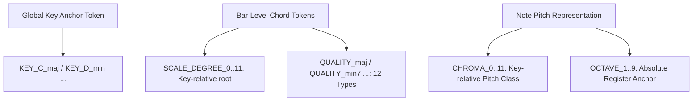
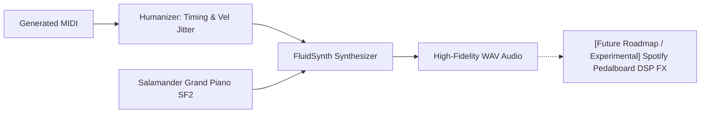

# 🎹 Real-Time AI Jam Station — Symbolic Transformer

> **Vocal melody → accompaniment generation via a symbolic (MIDI) decoder-only Transformer.**  
> 본 프로젝트는 보컬 멜로디(단선율) 입력을 기반으로 음악적으로 조화롭고 풍부한 다성부 피아노 반주를 실시간으로 생성하는 디코더 전용(Decoder-only) 트랜스포머 모델입니다.

---

## 🚀 1. Background & Paradigm Shift: Why Symbolic?

이전 버전의 시스템은 보컬의 오디오 스펙트로그램(Log-Mel Spectrogram)을 입력받아 반주 스펙트로그램을 직접 예측하는 **Pix2Pix 스타일의 cGAN** 구조를 취했습니다. 하지만 이 방식은 다음과 같은 치명적인 한계에 직면했습니다:

1. **One-to-Many(일대다) 모호성**: 하나의 멜로디에 어울리는 반주는 무한히 존재합니다. L1 회귀 손실(Regression Loss)이 포함된 오디오 판별기 구조에서는 생성기가 여러 가능성의 스펙트로그램을 **"평균화"**하게 만들어 결국 뭉개지고 건조한(Blurry & collapsed) 스펙트로그램만을 출력하며 학습이 `val_L1 ≈ 0.25` 수준에서 정체되었습니다.
2. **비효율적인 차원**: 오디오 신호는 노이즈와 아티팩트가 많아 음악적인 규칙(화성학, 리듬)을 추상화하여 학습하기 어렵습니다.

### 💡 The Pivot (심볼릭으로의 패러다임 전환)
본 프로젝트는 소리를 직접 다루는 대신 음악의 추상적 기호인 **MIDI(Symbolic)** 영역으로 피벗하였습니다.
* **조건(Condition)**: 입력 보컬 멜로디의 음높이(Pitch), 음장(Duration), 마디 내 위치(Bar/Position) 정보가 토큰화되어 제공됩니다.
* **대상(Target)**: 모델은 이에 반응하여 피아노의 음높이, 음색, 벨로시티(Velocity) 등을 오토레그레시브(Autoregressive)하게 디코딩합니다.
* **이점**: 크로스 엔트로피(Cross-Entropy) 손실 함수를 통한 확실한 확률적 확률 모델링을 적용하여 다양하면서도 음악적 문법을 정확히 준수하는 풍부한 반주를 실시간(KV-cached decoding)으로 생성합니다.

---

## 🏗️ 2. Key Architecture & Design Innovations

학습 정체와 단선율 생성 문제(반주가 단조롭고 얇게 나오는 현상)를 완벽히 극복하기 위해 설계된 핵심 기술적 혁신들입니다.

### A. 상대적 화성 부호화 (Relative Harmonic Encoding) & Chord Tokens
데이터 증강 시 조옮김(Transposition)을 수행하면 절대적인 음높이(Pitch) 토큰은 바뀌지만, 곡의 조성(Key)과 코드 진행(Chord Progression) 간의 **상대적 음악 구조**는 유지되어야 합니다. 이를 완벽하게 지원하기 위해 새로운 토큰 시스템을 설계했습니다.



#### 🎵 시퀀스 그래머 (Sequence Grammar Layout)
생성된 토큰 시퀀스는 다음과 같이 고도로 정형화된 문법 구조를 가집니다:

```
<BOS>  KEY_C_maj  TEMPO_8
  BAR  [SCALE_DEGREE_0  QUALITY_maj]                              ← 마디 공유 화음 (두 트랙 동일 적용)
  POS_0
    TRACK_melody        CHROMA_0  OCTAVE_5  DUR_4  VEL_24        ← 조건 (condition, 손실 제외)
    TRACK_accompaniment CHROMA_0  OCTAVE_3  DUR_8  VEL_18        ← 타깃 (target, 손실 적용)
    TRACK_accompaniment CHROMA_4  OCTAVE_3  DUR_8  VEL_16        ← 다성부 화음 적층 (Polyphony)
  POS_8
    TRACK_melody        CHROMA_4  OCTAVE_5  DUR_4  VEL_20  ...
    ...
  BAR  [CHORD_N]  ...
<EOS>
```
* **KEY**: 전역 조성 정보(24개 variant)를 첫머리에 제공하여 화성적 기준점을 제공합니다.
* **CHORD_N**: 코드가 없거나 식별되지 않는 마디를 위한 플레이스홀더 토큰입니다.
* **Temporal Interleaving**: 멜로디와 반주 토큰을 `<SEP>` 없이 POS 단위로 인터리빙합니다. 각 박자에서 `TRACK_melody` 음표가 먼저 나오고 `TRACK_accompaniment` 음표가 바로 뒤를 따르므로, 모델은 반주를 예측할 때 동일 시간에 발생하는 멜로디 맥락에 인과적으로 직접 접근할 수 있습니다.
* **relative Pitch**: 음높이를 절대값이 아닌 key-relative `CHROMA`와 절대 옥타브 `OCTAVE`로 쪼개어, 조옮김 시 `CHROMA`와 `SCALE_DEGREE`는 완벽히 불변으로 유지하고 `KEY`와 `OCTAVE`만 미세 조정하도록 데이터 증강 계약(Contract)을 보장합니다.

---

### B. 오토레그레시브 다성부 해킹 (Structural Suppression / Polyphony Hack)
트랜스포머 언어 모델은 일반적으로 시퀀스상에서 "한번에 하나의 음표"를 출력하려 합니다. 반주가 피아노 화음을 연주해야 할 때, 모델은 마지막 Note의 속성인 `VEL_*` 토큰을 예측한 뒤 **다음 두 가지 기로**에 서게 됩니다:

1. **화음 쌓기 (Polyphony)**: 현재 시간 위치(`POS_n`)에 또 다른 음표(`CHROMA_*`)를 올려 동시에 소리 나게 함.
2. **시간 진행 (Monophony)**: 다음 시간으로 건너뛰어 다음 박자(`POS_n+1`)나 마디(`BAR`) 토큰을 생성함.

모델이 화음을 쌓지 않고 자꾸 시간만 진행시키려는 단선율 고착화(Sparse generation) 문제를 제어하기 위해 **추론 제어 파라미터(Inference Control Variable)**를 도입했습니다.

$$\text{If } t_{\text{last}} \in \mathbf{V}_{\text{velocity}}:$$
$$\mathbf{L}_{\text{next}}[\mathbf{I}_{\text{struct}}] \leftarrow \mathbf{L}_{\text{next}}[\mathbf{I}_{\text{struct}}] - \gamma_{\text{suppress}}$$

* **작동 원리**: 마지막 샘플링된 토큰 $t_{\text{last}}$가 벨로시티 토큰 집합 $\mathbf{V}_{\text{velocity}}$ (`VEL_*` 계열)에 속할 때, 다음 토큰 예측 Logits인 $\mathbf{L}_{\text{next}}$에서 시간/구조 관련 토큰 인덱스 $\mathbf{I}_{\text{struct}}$ (`BAR`, `POS_*`, `TEMPO_*`, `TRACK_*` 등)의 값을 일정한 벌점 파라미터 $\gamma_{\text{suppress}}$ (설정값 `structural_suppression`)만큼 차감합니다.
* **기본값**: `structural_suppression: 0.0` (비활성). 아래의 `polyphony_loss_boost`로 다성부를 충분히 학습한 모델에서는 추론 시 이 보정이 필요 없습니다. 모델이 단선율로 수렴하는 경향이 관찰될 경우 1.0~2.0으로 활성화하세요.
* **효과**: 모델이 시간 축을 진행시키는 것을 인위적으로 억제하여, 동일한 POS 위치에 여러 음표(화음)를 겹쳐서 적층 생성하도록 유도합니다. 이 수치는 CLI나 YAML 설정을 통해 결정론적으로 조절이 가능합니다.

#### 🎸 학습 시 다성부 강화 (Polyphony Loss Boost)
추론 시 패널티에만 의존하는 대신, **학습 단계에서 직접 다성부 생성을 강화**합니다.
* `polyphony_loss_boost: 2.0` — 화음 위치의 PITCH/VEL 토큰에 cross-entropy 손실 가중치 2배를 적용합니다.
* 모델이 스스로 화음을 쌓는 것을 학습하므로 추론 시 `structural_suppression`이 필요하지 않습니다. `structural_suppression`은 만약 생성물이 여전히 단선율로 관찰될 때의 최후 수단으로만 남겨 둡니다.

---

### C. 분류기 없는 가이드라인 (Classifier-Free Guidance, CFG) — ✅ 구현됨

Temporal Interleaving 포맷에서도 CFG를 **추론 시점에 지원**합니다 (이전엔 미지원으로 분류됐으나 구현 완료).

* **학습 시**: `condition_dropout_prob: 0.075` 확률로 **한 청크의 모든 블록 멜로디**를 `<PAD>`로 교체하여 무조건부 배포 $P(\text{accom})$와 조건부 배포 $P(\text{accom} \mid \text{melody})$를 함께 학습합니다. (과거엔 첫 블록만 PAD하는 버그가 있었으나 전체 블록 PAD로 수정 → 진짜 무조건부 모드 학습.)
* **추론 시**: `generate_accompaniment`이 멜로디를 PAD한 무조건부 분기를 cond와 한 배치(2-row)로 동시에 forward하여 logits를 블렌딩합니다 (`cfg_w` 파라미터, app 슬라이더).

$$\mathbf{L}_{\text{cfg}} = \mathbf{L}_{\text{uncond}} + w \times (\mathbf{L}_{\text{cond}} - \mathbf{L}_{\text{uncond}})$$

* **가이드라인 강도($w$, `cfg_w`)**:
  * `w = 0.0`: 비활성 (단일 분기, 추론 비용 1×).
  * `w = 1.0`: 기본 조건부와 동일.
  * `w > 1.0` (주로 1.5~3.0): 멜로디 화성·박자에 반주가 더 강하게 밀착. (cond+uncond 동시 forward로 추론 2×)

### C-2. 화성 기피음 소프트 페널티 (Avoid-note Soft Penalty) — ✅ 구현됨

재학습 없이 추론 시점에 화성 충돌을 억제합니다. 모델이 생성한 코드(SCALE_DEGREE+QUALITY)를 실시간 추적하여, 그에 대한 **기피음**(예: 메이저 3도 위의 11음)에 해당하는 `CHROMA` logit을 부드럽게 감점합니다 (`avoid_note_penalty`, app 슬라이더). Hard mask가 아니라 soft penalty라 텐션·경과음 같은 색채음은 보존됩니다.

---

### D. 고품질 오디오 렌더링 (FluidSynth & Humanizer) 및 DSP 로드맵
AI가 MIDI 파일(심볼릭 데이터)을 아무리 훌륭하게 작곡해도, 렌더링된 사운드가 메마르고 기계적이면 사용자 경험(UX)이 극도로 저하됩니다. 이를 위해 고음질 음향 신호 처리 파이프라인을 구축했습니다.



1. **Humanizer (핵심 구현)**: 기계적인 정박 연주를 피하기 위해 미세한 릴리즈 시간 및 벨로시티 노이즈(`velocity_std: 6`, `timing_std_ms: 8.0`, `duration_std_ms: 5.0`)를 주입하여 인간 연주자 고유의 흔들림을 재현합니다. (코어 추론 스크립트에 탑재 완료)
2. **Premium Samples (핵심 구현)**: 16개 벨로시티 레이어를 지닌 전문가급 피아노 샘플 라이브러리(`Salamander Grand Piano.sf2` 등)를 FluidSynth로 마운트하여 기계적 신디사이저가 아닌 어쿠스틱 피아노 소리를 렌더링합니다.
3. **Spotify Pedalboard DSP (실험적 지원 및 로드맵)**:
   * Reverb(공간감), Compressor(다이내믹 피크 제어), Limiter(클리핑 방지)로 구성된 전문가용 DSP 체인입니다.
   * **현재 구현 상태**: 메인 코어의 결합 복잡성을 배제하기 위해 코어 라이브러리에서는 FluidSynth 기반 렌더링만 수행하며, Spotify `Pedalboard` DSP 체인은 **비교 평가 실행기(`scripts/compare_inference.py`)에서 패키지가 로컬 환경에 설치되어 있을 시 옵션으로 작동하는 실험적 기능**으로 구축해 두었습니다. 향후 코어의 기본 탑재 파이프라인으로 승격될 예정입니다.

---

## 📁 3. Workspace Repository Layout

리포지토리 내 주요 파일 및 디렉터리 구조와 역할입니다.

```
project_transformer/
├── configs/
│   ├── config.yaml             # Single Source of Truth (SSOT) 모든 하이퍼파라미터 통합 관리
│   ├── sweep_example.yaml      # 로컬 하이퍼파라미터 스윕 템플릿
│   └── wandb_sweep.yaml        # Weights & Biases 베이지안 스윕 설정
├── src/jam_transformer/
│   ├── __init__.py
│   ├── config.py               # YAML 환경 파일 → Python Dataclasses 검증 및 변환
│   ├── logger.py               # Loguru 기반 멀티 싱크 로깅 시스템
│   ├── tokenizer.py            # REMI v1 핵심 토크나이저 (상대 화음 및 키 부호화 구현)
│   ├── dataset.py              # PyTorch Dataset 및 WeightedRandomSampler (소스 균형 샘플링)
│   ├── model.py                # RoPE(회전식 위치 임베딩) 기반 Decoder-only Transformer + Polyphony Hack
│   ├── lightning_module.py     # PyTorch Lightning 학습 모듈, 토큰 타입별 가중 Cross-Entropy Loss
│   ├── train_components.py     # Optimizer (Fused AdamW) & Cosine Scheduler 레지스트리
│   └── pipeline.py             # 오디오 입력(기본 피치 변환) 및 최종 추론 통합 컨트롤 파이프라인
├── scripts/
│   ├── prepare_data.py         # POP909 / Lakh / Slakh MIDI → 전처리 토큰(.pt) 저장 (O(N log N) 스윕 라인 코드 추출)
│   ├── train.py                # GPU 최적화 PyTorch Lightning Trainer 학습 실행기
│   ├── inference.py            # 보컬 멜로디 MIDI 입력에 대해 실시간 피아노 반주 생성 스크립트
│   ├── compare_inference.py    # 학술 연구용 다양한 파라미터별 생성 결과 비교/시각화 도구 (핵심)
│   ├── download_pop909.py      # POP909 데이터셋 자동 다운로드 및 구조 셋업 스크립트
│   ├── download_lakh.py        # Lakh 데이터셋 유틸리티
│   ├── download_slakh.py       # Slakh 데이터셋 유틸리티 (HF API 기반 전체 Slakh2100 MIDI 및 메타데이터 다운로드)
│   ├── package_assets.py       # 대용량 바이너리 자산(체크포인트, 사운드폰트, 전처리 데이터) zip 압축 공유 도구
│   ├── inspect_data.py         # 인코딩/증강된 데이터를 시각적 MIDI로 복원하여 사전 청취 검사
│   ├── sweep.py                # 로컬 하이퍼파라미터 그리드/랜덤 스윕 오케스트레이터
│   └── controllability_sweep.py # 제어 파라미터 변화에 따른 음악 지표 추이 통계 도출 스크립트
├── tests/
│   ├── test_basics.py          # 토크나이저 왕복(Round-trip) 및 모델 포워드 기본 검사
│   ├── test_dynamics.py        # 다이내믹 변경 테스트
│   └── test_integration.py     # 전처리 → 학습 → 추론 → 파일 생성의 엔드투엔드 통합 CI 테스트
├── tools/fluidsynth/           # 윈도우용 FluidSynth 실행 및 DLL 라이브러리 바이너리 내장
├── docker/
│   ├── Dockerfile              # 일관된 GPU 분산 학습을 위한 도커 컨테이너 정의
│   └── docker-entrypoint.sh    # 컨테이너 진입점 스크립트
├── bundles/                    # package_assets.py 결과물 보관 (zip/sha256, git 제외)
├── analysis/
│   ├── report.md               # 프로젝트 종합 분석 보고서 (버그 수정 현황 + 최적화 진행표)
│   ├── audio_rendering_strategy.md # 고품질 음향 렌더링 전략 보고서
│   ├── evaluation_metrics_strategy.md # 학술용 정량/정성 평가 수립 보고서
│   ├── differentiation_analysis.md # 기존 프로젝트 대비 차별점/개선점/한계 분석 보고서
│   ├── structural_limitations.md   # 구조적 한계 및 개선 결과 보고서
│   ├── performance_optimization.md     # 성능 병목 분석 및 최적화 보고서
│   ├── pretraining_sanity_check.md     # 학습 전 자가 진단 프로토콜 및 검증 체크리스트
│   ├── comprehensive_review.md         # 종합 아키텍처 감사 및 전체 개선 현황판
│   ├── branch_design_changes.md        # main 브랜치 대비 설계 변경 비교 분석
│   └── archive/                        # 완료 또는 기각된 분석 문서 보관
├── docker-compose.yaml         # 서버 환경 간편 배포 컴포즈 파일
├── pyproject.toml              # 패키지 의존성 및 setuptools 메타데이터 정의
└── requirements.lock           # 고정된 의존성 락파일
```

---

## 📊 4. Academic Evaluation & Metrics Framework

모델의 음악적 수준을 객관적으로 입증하기 위해 설계된 종합 정량 평가 체계입니다. `scripts/compare_inference.py`를 실행하면 모든 결과가 테이블 및 그래프로 자동 요약됩니다.

| 평가 지표 (Metric) | 설명 | 측정 목적 |
| :--- | :--- | :--- |
| **Overlapping Area (OA)** | 실제 학습 셋과 생성 모델의 Pitch / Duration / Velocity 확률 분포 간의 교집합 면적을 측정 (0.0 ~ 1.0). | 모델의 확률론적 수렴 및 모사 완성도 입증 |
| **Pitch-Class Cosine Sim** | 생성된 피아노 반주의 12차원 Pitch-class 음높이 분포와 입력 멜로디의 분포 간 코사인 유사도를 측정. | 입력 멜로디와의 화성적 일치도(Harmony Alignment) 검증 |
| **Polyphony Rate** | 시간 노드 당 두 개 이상의 음표가 동시에 발생하는 확률(화음 비율). | 단선율 고착화 현상의 성공적 극복 증명 |
| **Onset Jaccard Similarity** | 실제 곡과 생성된 곡 간의 리듬 타격 시점(Onset Grid)의 합집합 대비 교집합 비율. | 리듬적 밀도와 그루브(Groove) 일치성 측정 |
| **Perplexity (PPL)** | 다음 토큰 예측의 불확실도 계수. 낮을수록 음악적 문법을 정확히 이해하고 있음을 뜻함. | 언어 모델링의 수치적 성능 보장 |

### 📈 Controllability Trend (제어 가능성 분석)
`controllability_sweep.py`를 통해 `structural_suppression` 파라미터를 점진적으로 올림에 따라, 무작위 잡음이 아닌 **실제 Polyphony Rate 지표가 비례하여 상승하는 상관관계**를 레이더 차트 및 꺾은선 그래프로 시각화하여 제출할 수 있습니다. 이는 연구자의 의도대로 모델이 결정론적으로 조절됨을 증명하는 강력한 근거가 됩니다.

---

## 🐳 5. 처음 시작하는 분 — Docker 학습 가이드

Docker와 딥러닝 환경 설정이 처음이라면 **[TRAINING_GUIDE.md](TRAINING_GUIDE.md)** 를 먼저 읽어주세요.  
클론 → 자산 다운로드 → Docker 빌드 → 16GB VRAM 설정 → 체크포인트 재개까지 단계별로 안내합니다.

---

## 🚀 6. Quickstart & Essential Workflows

### A. 역할별 설치 (Extra Groups)

| 역할 | 커맨드 |
|---|---|
| 학습 (서버) | `pip install -e ".[train,dev]"` |
| 추론 CLI only | `pip install -e ".[render,audio]"` |
| 웹 데모 | `pip install -e ".[render,audio,demo]"` |
| 전체 (학습 + 추론 + 데모) | `pip install -e ".[train,dev,render,audio,demo]"` |

> **pytorch-lightning**은 학습(`[train]`)에만 필요합니다. 추론·시연 환경에는 설치하지 않아도 됩니다.

---

### B. 로컬 환경 초간단 실행 (1분 개발자 검증)
```bash
# 1. 의존성 패키지 및 개발용 유틸리티 설치 (학습 + 개발 도구)
pip install -e ".[train,dev]"

# 2. 인공합성 음악 데이터를 이용한 초고속 토큰 빌드
python scripts/prepare_data.py --synthetic --num_songs 32 --out_dir data/processed

# 3. 모델 정상 구동 검사를 위한 스모크 학습 (2 Epochs, 약 30초 소요)
python scripts/train.py --epochs 2

# 4. 테스트용 MIDI를 이용한 오디오 및 MIDI 반주 생성
python scripts/inference.py --melody_midi tests/test_melody.mid --output out.mid

# 5. 전체 유닛 및 엔드투엔드 통합 테스트 실행
pytest -q
```

---

### C. 서버 환경 GPU 제로-바틀넥(Zero-Idle) 트레이닝 레시피
GPU 클라우드를 대여할 때, 비싼 서버 비용이 낭비되지 않도록 모든 전처리 작업을 로컬(CPU)에서 마치고 서버로 전송하는 최적화 워크플로우입니다.

```bash
# [1] 로컬 PC에서 대용량 데이터셋 다운로드 및 전처리 (GPU 불필요)
# POP909 (~수십 MB, GT 코드 주석 포함)
python scripts/download_pop909.py --out_dir data/raw/POP909
python scripts/prepare_data.py --pop909_dir data/raw/POP909 --out_dir data/processed

# Lakh (수 GB, 약 17,000곡 — melody coverage >= 20% 필터 자동 적용)
python scripts/download_lakh.py --out_dir data/raw/lmd_clean
python scripts/prepare_data.py --lakh_dir data/raw/lmd_clean --out_dir data/processed

# Slakh (~96MB, 전문 편곡 866곡 — HF_TOKEN 필요)
python scripts/download_slakh.py --out_dir data/raw/slakh2100
python scripts/prepare_data.py --slakh_dir data/raw/slakh2100 --out_dir data/processed

# [2] 서버 업로드용 미세 경량 번들 자동 패키징 (약 5MB 압축본 생성)
python scripts/package_for_server.py --out jam_tx_bundle.tgz
```

> [!TIP]
> `_chunk_index.json` 덕분에 학습 시작 시 수천 개의 데이터 청크 로딩 속도가 $O(1)$로 최적화됩니다. 또한 `_dataset_meta.json`에 토크나이저 핑거프린트가 기록되어 설정 불일치로 인한 GPU 학습 오작동을 원천 방지합니다.

```bash
# [3] GPU 대여 서버에 전송 후 배포
scp jam_tx_bundle.tgz user@gpu-server:~/
ssh user@gpu-server

tar -xzf jam_tx_bundle.tgz && cd project_transformer
docker compose build

# [4] 예산 및 VRAM 체크용 드라이런 실행 (필수 단계!)
docker compose run --rm train python scripts/train.py --dry_run_steps 100

# [5] 본격적인 멀티 GPU 200 Epochs 학습 시작
docker compose run --rm train python scripts/train.py --epochs 200
```

---

### D. 📊 학술 비교 평가 실행기 (compare_inference.py)
특정 곡에 대해 원본(GT) 반주와 다양한 설정(`T=1.0`, `T=0.7`, `CFG=2.0` 등)으로 생성된 반주의 품질 및 다이내믹을 한 번에 비교 분석합니다.

```bash
python scripts/compare_inference.py \
    --song 001 \
    --checkpoint checkpoints/best.ckpt \
    --pop909_dir data/raw/POP909 \
    --out_dir output/compare_001
```

#### 📥 출력 아티팩트 (`output/compare_001/`):
* `midi/`: 원본 및 세대별 MIDI 파일들 (`01_ground_truth.mid`, `02_gen_cfg20.mid` 등)
* `wav/`: `FluidSynth`로 렌더링된 WAV 파일들 (Pedalboard 패키지 설치 시 Reverb/Limiter 등 DSP 마스터링 추가 가능)
* `wav/05_comparison.wav`: 비프음 신호와 함께 모든 사운드가 하나의 오디오 트랙으로 이어진 청감 평가용 트랙
* `metrics/comparison_report.md`: PC Cosine, Onset Jaccard 등 모든 지표가 정리된 학술 마크다운 테이블
* `metrics/plots/`: 논문 게재용 비교 시각화 그래프들 (**오각형 레이더 차트**, 피치 분포 히스토그램, 벨로시티 분포, 음장 분포 등)

---

### E. 📦 대용량 바이너리 자산 패키징 및 공유 (package_assets.py)
Git 관리에서 제외된 대용량 이진 자산들을 **역할별로 분리된 zip 파일**로 패키징해 GitHub Releases에 업로드합니다.  
수신자는 목적에 맞는 파일만 선택적으로 다운로드할 수 있습니다.

```bash
# 학습 마일스톤마다 갱신 — 모델 가중치
python scripts/package_assets.py --preset checkpoints   # → jam_checkpoints.zip

# 한 번만 업로드 — 피아노 음색 파일
python scripts/package_assets.py --preset soundfonts    # → jam_soundfonts.zip

# 한 번만 업로드 — 전처리 완료된 학습 데이터
python scripts/package_assets.py --preset data          # → jam_data_processed.zip
```

| 파일 | 내용 | 필요한 경우 |
|---|---|---|
| `jam_checkpoints.zip` | `checkpoints/` | 항상 필요 |
| `jam_soundfonts.zip` | `soundfonts/` | 반주 생성(추론) 시 필요 |
| `jam_data_processed.zip` | `data/processed/` | 학습 재개 시 필요 |

> raw 데이터(`data/raw/`)는 공개 데이터셋이므로 포함하지 않습니다.  
> 수신자는 `download_pop909.py` / `download_lakh.py` / `download_slakh.py` 로 직접 받습니다.

#### 📥 수신자의 환경 복원
모든 zip을 **저장소 루트 폴더에서 압축 해제**하면 `checkpoints/`, `soundfonts/`, `data/processed/` 가 자동으로 제자리에 생깁니다.  
자세한 내용은 [TRAINING_GUIDE.md](TRAINING_GUIDE.md) 2단계를 참고하세요.

---

## 🔌 7. Pluggable Registry System: Extensibility

프로젝트 내부의 모든 핵심 컴포넌트(토크나이저, 모델, 옵티마이저, 스케줄러)는 데코레이터 패턴 기반의 레지스트리 시스템으로 캡슐화되어 있어, 다른 연구원들이 코드를 직접 수정하지 않고 설정 변경만으로 새로운 실험을 할 수 있습니다.

### 새로운 토크나이저 등록 예시:
```python
from jam_transformer.tokenizer import BaseTokenizer, register_tokenizer

@register_tokenizer("my_super_tokenizer")
class MySuperTokenizer(BaseTokenizer):
    def __init__(self, cfg):
        super().__init__(cfg)
        # 자신만의 특수한 어휘집 및 부호화 문법 구현
        
    # 추상 메서드 구현...
```

## ⚖️ 8. Comparative Landscape & Technical Analysis (차별점 및 한계 분석)

본 프로젝트(**Symbolic Jam Transformer**)가 기존 AI 작곡 패러다임과 비교하여 가지는 고유한 가치와 개선점, 그리고 공학적 한계점을 엄격하게 요약합니다.

### A. 핵심 차별점 (Differentiation)
* **조-불변 상대적 하모닉 토크나이저**: 절대 음높이(MIDI Note 0~127) 대신 조성(`KEY`) 기준의 **상대적 음도(Scale Degree), 화음 종류(Chord Quality), 상대 크로마(Chroma) 및 옥타브 레지스터**로 음높이를 해체 인코딩했습니다. 조옮김 transposition 시에도 핵심 토큰 구조가 100% 동일하게 불변(Invariant)하여 학습 데이터 효율과 화성적 안정성을 혁신했습니다.
* **실시간 인터랙티브 상호작용**: 고정된 길이를 오프라인 보간하는 VAE(MusicVAE)와 달리, Causal Self-Attention 단일 디코더 상에서 멜로디 조건(Condition Prefix) 하에 실시간 즉흥 반주 디코딩을 가능하게 합니다.
* **디코딩 시점 다성부 제어**: 재학습이나 매개변수 수정 없이, 추론 시점의 `structural_suppression` 패널티 차감 조작만으로 화음 밀도(Polyphony Rate)를 결정론적으로 동적 조절할 수 있습니다.

### B. 기술적 개선점 (Improvements)
* **회귀 붕괴 극복**: 기존 cGAN 스펙트로그램 직접 매핑 모델의 One-to-Many 모호성으로 인한 흐릿한(blurry) 평균치 수렴 붕괴를 극복하고, 심볼릭 토큰 크로스 엔트로피 분류 체계로 선명하고 정확한 화성을 작곡합니다.
* **초경량 최적화**: 수억~수십억 파라미터를 소모하는 EnCodec 기반 오디오 토큰 모델(MusicGen 등)과 달리, 단 **38M 파라미터**의 정제된 Transformer 아키텍처를 구현하고 RoPE 및 Gradient Checkpointing을 결합하여 무료 Colab GPU(T4) 혹은 저사양 로컬 환경에서 단 2-3시간 만에 고속 학습 수렴이 가능하게 만들었습니다.
* **토큰 무결성 검사**: 전처리 시 `_dataset_meta.json`에 기록된 토크나이저 해시값(Fingerprint)을 로딩 즉시 대조함으로써, 설정 drift로 인한 학습 오류 및 CUDA 충돌 문제를 100% 미연에 차단합니다.
* **소스 균형 샘플링 (Source-Balanced Sampling)**: 자연 분포(현재 chunk 기준 Lakh ≈89% / Slakh ≈8% / POP909 ≈3%, 셔드 15,897 / 1,355 / 909)를 목표 분포(Lakh 55% / Slakh 40% / POP909 5%)로 재조정하는 `WeightedRandomSampler`를 도입했습니다. 전문 편곡 품질의 Slakh를 **약 4.9배 오버샘플링**(redux 1,710곡 도입으로 과거 ×8.5보다 반복이 줄어 건강해짐)하여 화음 품질을 높이고, 중국 팝 장르 편향이 있는 POP909는 낮게 고정합니다. 가중치는 데이터 분포 변화에 맞춰 재계산됩니다(`source_weight_*`).

### C. 냉정한 한계점 (Limitations)
* **음원 합성 품질의 사운드폰트 의존성**: 물리적 오디오를 생성하지 않고 작곡 기호(MIDI)를 출력하기 때문에, 최종 WAV의 음질 및 Realism이 로드된 외부 사운드폰트(`.sf2`)의 음색에 절대적으로 종속됩니다.
* **시간 양자화 그리드 제약**: 16분 음표 그리드 시스템의 한계로 인해 생성 단독으로 스윙(Swing), 엇박자 그루브, 루바토(Rubato) 같은 유연한 인간적 시간 그루브를 작곡하는 능력이 구조적으로 배제되어 있습니다 (Humanizer 후처리로 보완).
* **로컬 컨텍스트 윈도우 한계**: `max_seq_len: 2560` 제한으로 인해 대략 12~16마디 내의 맥락은 대위법적으로 영리하게 추적하지만, 곡 전체(Verse $\to$ Chorus $\to$ Outro)를 아우르는 거시적인 장기 의존성 구조를 일관성 있게 조율하는 장기 기억에는 한계가 있습니다.

> [!NOTE]
> 더욱 자세한 학술적 심층 분석과 정량 지표 대조표는 [analysis/differentiation_analysis.md](file:///c:/Users/hojun/Documents/대학교%20자료/3학년%201학기(2026-1)/기학지/과제/project_transformer/analysis/differentiation_analysis.md) 보고서 전문을 참조해 주시기 바랍니다.

---

## 🔀 9. main 브랜치 대비 핵심 설계 변경 (Branch Design Changes)

`feat/single-stream-accompaniment` 브랜치는 main 브랜치에서 다음과 같은 구조적 설계 변경을 적용했습니다.  
상세한 설계 의사결정 근거와 트레이드오프 분석은 [analysis/branch_design_changes.md](analysis/branch_design_changes.md)에 수록되어 있습니다.

| 구분 | main 브랜치 | 현재 브랜치 |
| :--- | :--- | :--- |
| **트랙 구조** | 3트랙: melody + bridge + piano | 2트랙: melody + accompaniment |
| **시퀀스 포맷** | SEP-분리형 (melody 블록 → `<SEP>` → piano 블록) | Temporal Interleaving (POS 단위 인터리빙, SEP 미발행) |
| **어휘 크기** | 174 토큰 (TRACK_bridge 포함) | 173 토큰 |
| **최대 시퀀스 길이** | 2048 토큰 | 2560 토큰 |
| **다성부 제어 전략** | `structural_suppression: 1.5` (추론 시 항상 활성) | `polyphony_loss_boost: 2.0` (학습으로 근본 해결); `structural_suppression: 0.0` (비활성) |
| **CFG 추론** | 지원 (`condition_dropout_prob: 0.15`) | ✅ 지원 (cond/uncond 2-row 블렌딩 `cfg_w`); dropout `0.075` (전체 블록 PAD) |
| **데이터 샘플링** | 균등 (자연 분포) | `WeightedRandomSampler`: Slakh ×4.9 / Lakh ×0.62 / POP909 ×1.8 (목표 55/40/5) |
| **Train/Val 분할** | 스트라이드 기반 인덱스 | SHA-256 곡 단위 분할 (`val_ratio: 0.2`, 데이터 누수 차단) |
| **Checkpoint 주기** | 100 steps (I/O 병목) | 1000 steps |
| **멜로디 밀도 필터** | 없음 | `min_melody_coverage: 0.20` (저커버리지 곡 자동 제거) |

---
> **2026-05-31 갱신 요약**: 데이터 재전처리(Slakh redux 1,710 → 18,161 shard), Slakh 멜로디 추출
> 캐스케이드(instrument GT → miner → weight), 소스 가중치 55/40/5 재교정, condition-dropout 전체
> 블록 PAD 수정(0.075), **CFG 추론 구현**(`cfg_w`), **avoid-note soft penalty**(`avoid_note_penalty`),
> RAM 티어 LRU 셔드 캐시. 위 §3 파일 트리는 utils/·preprocessing/ 서브패키지 분리 및 scripts/tools·
> scripts/analysis 재배치 *이전* 기준이라 일부 경로가 옛 위치입니다.

**최종 업데이트:** 2026-05-31  
**프로젝트 주제:** 상징적 피아노 반주 생성을 위한 디코더 트랜스포머 및 추론 성능 고도화 시스템  

