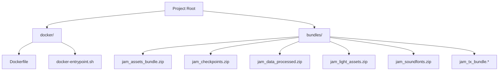

# 📂 프로젝트 폴더 및 파일 구조 정리 (Directory Reorganization) - 적용 완료

본 문서에서는 프로젝트 루트 디렉토리에 흩어져 있던 Docker 설정 파일 및 배포/에셋 번들 압축 파일들의 정돈 상태를 정리합니다. 제안되었던 구조적 정리 계획이 성공적으로 완수되었습니다.

---

## 🛠️ 정리 완료된 디렉토리 구조



### 1. Docker 설정 파일 그룹화
* **수행 내용**: Docker 관련 설정 파일들을 `docker/` 폴더 하위로 모아 루트 경로를 정돈하였습니다.
* **이동 완료**:
  - `Dockerfile` $\to$ [docker/Dockerfile](file:///c:/Users/hojun/Documents/대학교 자료/3학년 1학기(2026-1)/기학지/과제/project_transformer/docker/Dockerfile)
  - `docker-entrypoint.sh` $\to$ [docker/docker-entrypoint.sh](file:///c:/Users/hojun/Documents/대학교 자료/3학년 1학기(2026-1)/기학지/과제/project_transformer/docker/docker-entrypoint.sh)
* **보존 항목**: `.dockerignore` 파일은 Docker 빌드 컨텍스트의 탐색 규칙 상 프로젝트 루트에 그대로 보존하여 정상 빌드를 보장합니다.

### 2. 배포 및 에셋 번들 그룹화
* **수행 내용**: 각종 백업 및 다운로드된 대용량 압축 파일들을 `bundles/` 폴더 하위로 격리시켰습니다.
* **이동 완료**:
  - `jam_assets_bundle.zip`, `jam_checkpoints.zip`, `jam_data_processed.zip`, `jam_light_assets.zip`, `jam_soundfonts.zip`, `jam_tx_bundle.tar.zst`, `jam_tx_bundle.sha256` 등 모든 아카이브를 `bundles/` 내부로 통합 관리합니다.

---

## ⚙️ 연동 설정 파일 수정 완료 사항

### ① `docker-compose.yaml` (루트 유지)
Docker 빌드 파일의 경로를 새 경로(`docker/Dockerfile`)로 지정하여, 컨테이너 빌드가 끊김 없이 구동되도록 연동 설정을 수정하였습니다.
```yaml
services:
  jam-transformer:
    build:
      context: .
      dockerfile: docker/Dockerfile
```

### ② `docker/Dockerfile` (이동 완료)
빌드 컨텍스트 루트를 기준으로 내부 `COPY` 경로를 `docker/docker-entrypoint.sh`로 적절하게 변경하여 빌드 실패 오작동을 차단하였습니다.
```dockerfile
COPY docker/docker-entrypoint.sh /usr/local/bin/
```

### ③ `.gitignore` (루트 유지)
각 압축파일명을 수동으로 지정해 무시하던 방식을 없애고, `/bundles/` 폴더 자체를 무시하도록 간결하게 교정했습니다.
```gitignore
# 5. 빌드 및 배포 번들 (Build & Deployment Bundles)
/bundles/
```
